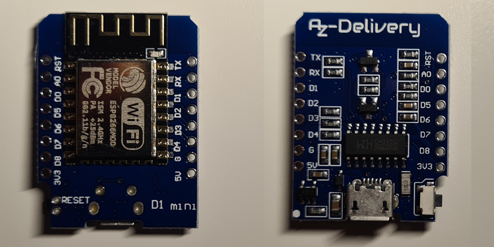
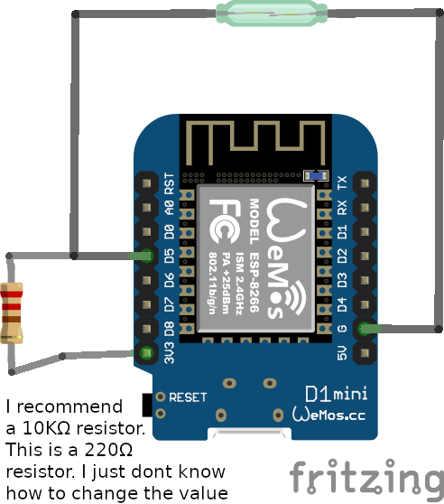

# Overview
We all know these moments:
- You are watching movie/series and your perents walk in at the worst time possible
- You are clicking on a link a friend send you out of curiosity and your parents come in because you have to do the dishes.

Guess what? You are looking at the soultion right now. This is a little device, that you install at your door and sends a little message to your PC to tell it to hide all your windows. (This can be customized of course) 

# Index

### [Hardware requirements ](#hardware-requirements)
1. [esp8266](#1-esp8266) - you need an esp8266
2. [Sensor](#2-sensor) - you will also need a sensor for the door
3. [Wires](#3-some-wires) - how to connect the esp8266 to the sensor

### [Software requirements](#software-requirements) - what is supported?
### [Build one yourself!](#build-one-yourself) - how to build it
1. [Flash the esp8266](#flash-the-esp8266)
2. [Download the program for windows](#download-the-program-for-windows)
3. [Connect the sensor to the esp8266](#connect-the-sensor-to-the-esp8266)
### [Tips & Tricks](#tips-and-tricks) - thinks that I recommend you do, but are not required

# Hardware requirements
## 1. esp8266

Search for [esp8266 d1 mini][] to find where you can buy one.\
Other esp8266's will work too.

[esp8266 d1 mini]: https://duckduckgo.com/?q=buy+esp8266+d1+mini

  
Picture of the one I have

&nbsp;
## 2. Sensor

You will need a sensor that can detect, when the door opens.\
I am using a [reed switch][] (magnet sensor) but glueing something together with wires and aluminium foil will work too (I think)

[reed switch]: https://en.wikipedia.org/wiki/Reed_switch

&nbsp;
## 3. Some wires
You will need to connect the sensor to the esp8266. I strongly recommand a soldering iron here. If you find another solution, feel free to tell me. I will add your solution here.

&nbsp;
# Software requirements
Currently **Windows** and **Linux** are supported.

  
For the Linux guys

  I am personally use i3 as a window manager.
  Please open an issue and tell me your window manger, so I can add support for it.

 

&nbsp;

# Build one yourself!
## Flash the esp8266
For now, you will need to download the [arduino ide][] (or another ide like Platform IO) to flash the esp8266.\
Because I am working on a much simpler solution, I will not provide details here but there are good tutorials online. Do not forget to set your wifi ssid(name) and password in 'secrets.h' you can find the source code for the arduino in 'source_esp8266/src' 

[arduino ide]: https://www.arduino.cc/en/guide/windows

## Download the program for windows
Click [here][] to download **main.exe** under Assets.\
Because I have not signed the application yet, you will have click on "More Information" and then on "run anyway" when you run the file. If you do not trust me(and you shouldn't) you can look into the source code and compile it yourself with [go][]

After you run the application, a config file will be created. Usually you do not have to change anything. If there is no error message in the console, you are ready to test it! After connecting the esp8266 of course. (See the next stop)

[here]: https://github.com/IHaveToChangeMyUsername/privateWindows/releases/
[go]: https://go.dev/

## Connect the sensor to the esp8266

Click here to see the Diagram

&nbsp;
# Tips and Tricks

  
Disable Window minimize animation to hide windows faster

  1. Open the start menu and search for *"Advanced System Settings"* and click on the first result
  2. Under Performance, click Settings
  3. Uncheck *"Animate windows when minimizing or maximizing option"*
  4. Click Ok.

